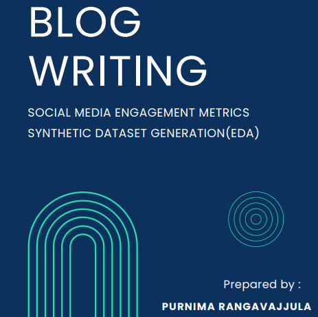

# Social-Media-Engagement-Metrics-Synthetic-dataset

Welcome to the Social Media Synthetic Dataset EDA Generation project! This repository provides a comprehensive exploration of synthetic social media datasets, designed to facilitate insightful Exploratory Data Analysis (EDA).

# Features:
Rich Synthetic Data: Explore a diverse range of synthetic social media data meticulously crafted to mirror real-world scenarios.
Comprehensive EDA: Dive deep into the dataset with an array of analytical tools, visualizations, and statistical techniques.
Ready-to-Use Scripts: Effortlessly generate EDA reports with pre-configured scripts, saving time and resources.
Modular and Extensible: Customize your analysis with modular components, allowing seamless integration of additional datasets or analytical methods.

# Usage:
Clone the Repository: Clone or download this repository to your local machine.
Install Dependencies: Ensure you have the necessary dependencies installed. (Requirements listed in requirements.txt)
Generate EDA: Utilize provided scripts to generate comprehensive EDA reports for the synthetic datasets.
Explore and Analyze: Dive into the generated reports to gain valuable insights into the synthetic social media datasets.

# Contributions:
Contributions and feedback are welcome! Whether it's bug fixes, feature enhancements, or dataset expansions, your contributions can help improve this project and benefit the community.

Feel free to customize and expand upon this template to best suit your project's needs!
